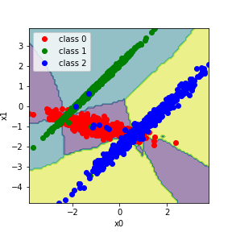

## Lets increase score by blending different ML models

We are using followed models, written from scratch in Python:
- KNN
- SoftMax Regression
- Decision Tree
- Random Forest

As a blender (meta algorithm) we can use one of them.

The blending is about:

Data set is devided by three parts.
First part is used for main models fit.
They produce predictions on the second part.
Those predictions are the fratures for the meta model. 
Then we train meta model and test it on the third part of the data.

It is said - blending can increase score of the predictions.

The result of a blending for multiclass classification.

